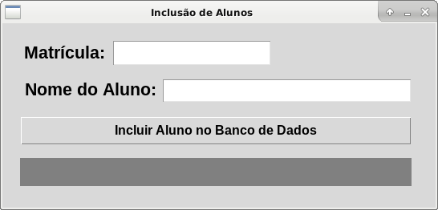

# Banco-de-Dados-no-Python

# Inclusão de Alunos com Python e SQLite

Este projeto implementa uma aplicação em Python para gerenciar a inclusão de alunos em um banco de dados SQLite. A interface gráfica é desenvolvida utilizando a biblioteca TKInter. Siga as orientações abaixo para configurar e utilizar a aplicação.

---

## Captura de Tela da Interface
**Insira aqui a captura de tela da interface ou do aplicativo.**  
Adicione a imagem no repositório e substitua o texto abaixo pelo link do arquivo.



---

## Funcionalidades
1. Inserir registros com valores de **Matrícula** e **Nome do Aluno** em uma tabela chamada `registros` no banco de dados `alunos.db`.
2. Verificar se uma matrícula já está cadastrada no banco de dados.
3. Exibir mensagens informativas na interface gráfica (Label 3) sobre o status do cadastro:
   - **Matrícula já Cadastrada**
   - **Aluno Cadastrado com Sucesso!!!**
4. Imprimir no console (modo texto) a lista de todos os alunos cadastrados no banco de dados.

---

## Orientações para Uso
1. **Preencha os campos de entrada da interface gráfica**:
   - Insira uma matrícula no campo **`Entry1`**.
   - Insira o nome do aluno no campo **`Entry2`**.
2. **Clique no botão**:
   - Clique em **`Incluir Aluno no Banco de Dados`** para registrar os dados no banco.
3. **Resultados Esperados**:
   - **Se a matrícula já existir no banco de dados**:
     - A mensagem **"Matrícula já Cadastrada"** será exibida no **Label 3**.
   - **Se a matrícula for nova**:
     - O registro será inserido no banco de dados.
     - A lista atualizada de alunos será exibida no console, com **Matrícula** e **Nome**.
     - A mensagem **"Aluno Cadastrado com Sucesso!!!"** será exibida no **Label 3**.

---

## Requisitos
- **Linguagem**: Python 3.x
- **Bibliotecas Necessárias**:
  - `sqlite3` para manipulação do banco de dados.
  - `tkinter` para interface gráfica.

---

## Modelo de Interface
O modelo de interface gráfica pode ser encontrado no [link do modelo](#).

---

## Estrutura do Banco de Dados
- Nome do Banco de Dados: **`alunos.db`**
- Nome da Tabela: **`registros`**
- Estrutura da Tabela:
  - **`matricula`**: Tipo `INTEGER`, chave primária.
  - **`nome`**: Tipo `TEXT`, obrigatório.

---

## Passo a Passo para Configuração
1. Clone o repositório para sua máquina local:
   ```bash
   git clone <link-do-repositorio>
   cd <nome-do-repositorio>
